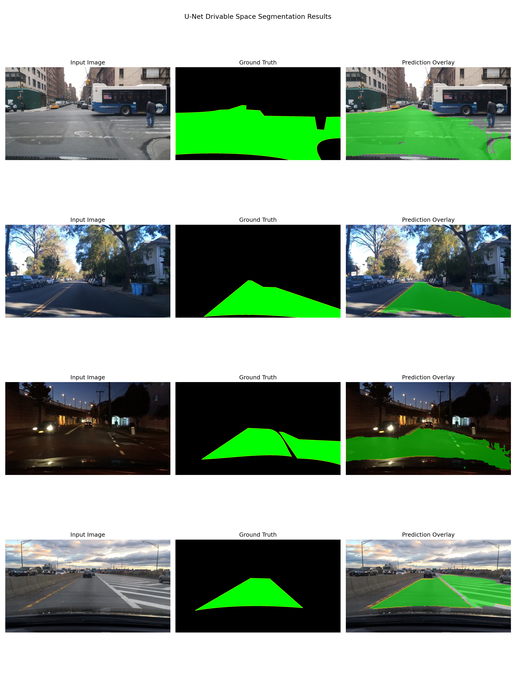
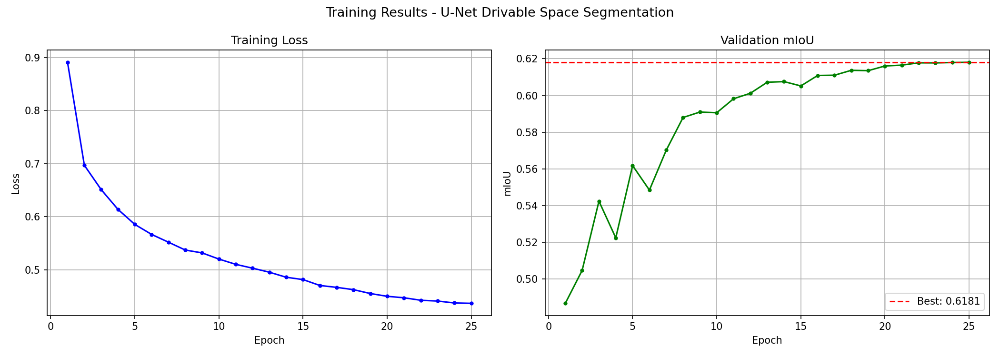

<div align="center">

# 🚗 Real-Time Drivable Space Segmentation

### MAHE Mobility Challenge | Hackathon 2026 — Problem Statement 2

**Team NeuralNavigators**


</div>

---

## 🎯 Overview

A **custom U-Net architecture built from scratch** for real-time drivable space segmentation, trained on BDD100K and nuScenes datasets. The model identifies drivable road areas in real-time with high accuracy and speed — no pretrained weights used.

---

## 🏆 Results

<div align="center">

| Metric | Score |
|--------|-------|
| 🎯 mIoU | **0.6181** |
| ⚡ FPS | **77.3** |
| 🧠 Parameters | **7.7M** |
| 📅 Epochs | **25** |

</div>

---

## 🖼️ Predictions

> Green overlay = Drivable space detected by the model



---

## 📈 Training Curves



---

## 🏗️ Model Architecture
```
Input Image (3, H, W)
        │
        ▼
┌─────────────────────┐
│   Encoder Block 1   │  32 channels
│   Conv → BN → ReLU  │
└────────┬────────────┘
         │ Skip Connection ──────────────────────┐
         ▼                                       │
┌─────────────────────┐                          │
│   Encoder Block 2   │  64 channels             │
└────────┬────────────┘                          │
         │ Skip Connection ───────────────┐      │
         ▼                               │      │
┌─────────────────────┐                  │      │
│   Encoder Block 3   │  128 channels    │      │
└────────┬────────────┘                  │      │
         │ Skip Connection ────────┐     │      │
         ▼                        │     │      │
┌─────────────────────┐           │     │      │
│   Encoder Block 4   │  256 ch   │     │      │
└────────┬────────────┘           │     │      │
         ▼                        │     │      │
┌─────────────────────┐           │     │      │
│     Bottleneck      │  512 ch   │     │      │
└────────┬────────────┘           │     │      │
         ▼                        │     │      │
┌─────────────────────┐           │     │      │
│   Decoder Block 1   │ ◄─────────┘     │      │
└────────┬────────────┘                 │      │
         ▼                             │      │
┌─────────────────────┐                │      │
│   Decoder Block 2   │ ◄──────────────┘      │
└────────┬────────────┘                       │
         ▼                                    │
┌─────────────────────┐                       │
│   Decoder Block 3   │ ◄─────────────────────┘
└────────┬────────────┘
         ▼
┌─────────────────────┐
│   Output (1, H, W)  │  Drivable mask
└─────────────────────┘
```

---

## 📂 Repository Structure
```
drivable-space-segmentation/
├── model.py              # U-Net architecture (from scratch)
├── train.py              # Training pipeline
├── infer.py              # Inference & visualization
├── inspect_dataset.py    # Dataset exploration
├── requirements.txt      # Dependencies
├── results/
│   ├── predictions.png   # Sample predictions
│   └── training_curves.png # Loss & mIoU curves
└── README.md
```

---

## ⚙️ Training Details

| Component | Details |
|-----------|---------|
| Architecture | Custom U-Net (no pretrained weights) |
| Dataset | BDD100K + nuScenes |
| Loss Function | Dice Loss + Cross Entropy |
| Optimizer | AdamW |
| Scheduler | CosineAnnealingLR |
| Epochs | 25 |

---

## 🚀 Quick Start

### 1. Install dependencies
```bash
pip install -r requirements.txt
```

### 2. Train the model
```bash
python train.py
```

### 3. Run inference
```bash
python infer.py
```

---

## 👥 Team

**Team NeuralNavigators**
MAHE Mobility Challenge | Hackathon 2026

---

<div align="center">
Built from scratch with ❤️ for MAHE Mobility Challenge 2026
</div>